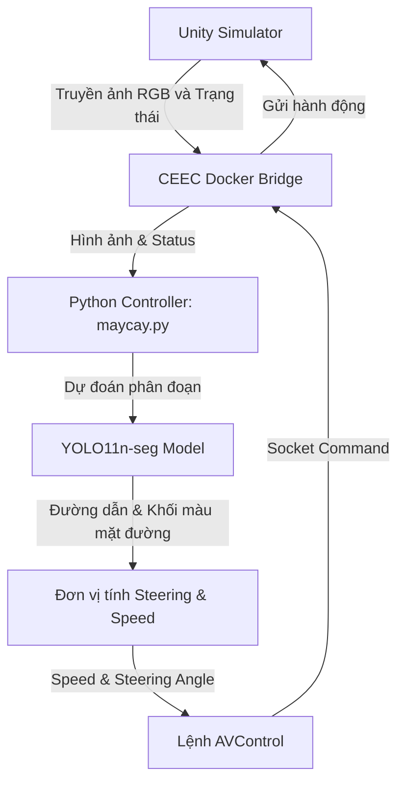

# 🏁 Dự án UIT-CAR-RACING: Unity Autonomous Road Segmentation & Navigation
> **Tổng quan hệ thống lái xe tự hành kết hợp giữa mô phỏng Unity 3D, phân đoạn làn đường (Road Segmentation) và phân đoạn biển báo giao thông (Traffic Sign Segmentation) sử dụng mô hình YOLO.**

---

## 📸 1. Tổng quan Dự án & Bối cảnh Cuộc thi (Project Overview & Contest Context)

Dự án **UIT-CAR-RACING** được phát triển nhằm phục vụ cuộc thi lập trình xe tự hành **"UIT CAR RACING 2025 MÙA XIV - BẢNG CHUYÊN NGHIỆP"** do Khoa Kỹ thuật Máy tính - Trường Đại học Công nghệ Thông tin, ĐHQG-HCM tổ chức.

Hệ thống được thiết kế linh hoạt để vượt qua các vòng thi đấu của cuộc thi:
1. **Vòng Sơ loại & Khởi động (Mô phỏng - Simulation)**: Xe tự hành bám làn và nhận diện biển báo trong môi trường giả lập **Unity 3D**. Bộ điều khiển Python chạy độc lập và giao tiếp với simulator thông qua kết nối Socket (Docker container).
2. **Vòng Chung kết (Sa hình thực tế - Real Car)**: Lập trình chạy trực tiếp trên **mô hình xe thật và sa bàn vật lý** do Ban tổ chức cung cấp. Việc sử dụng mã nguồn điều khiển dựa trên Python giúp dễ dàng chuyển đổi mã nguồn từ môi trường giả lập sang hệ thống nhúng của xe thật.

### 🏆 Lợi thế điểm số của việc Tự Huấn luyện Model AI
Theo Thể lệ Cuộc thi chính thức tại Bảng Chuyên nghiệp, mỗi bản đồ thi đấu có **10 checkpoints** và điểm số xử lý ảnh được tính như sau:
* **Sử dụng Model AI tự xử lý nhận diện (YOLO11n-seg tự huấn luyện)**: Đạt **10 điểm / 1 checkpoint** (Tổng tối đa 100 điểm).
* **Sử dụng ảnh Phân đoạn (Segment) mặc định do BTC cung cấp**: Chỉ đạt **5 điểm / 1 checkpoint** (Tổng tối đa 50 điểm).

> [!IMPORTANT]
> Việc phát triển bộ công cụ tự huấn luyện mô hình YOLO phân đoạn làn đường và nhận diện biển báo trong thư mục `training/` là yếu tố cốt lõi quyết định **gấp đôi điểm số tối đa** cho đội thi, tạo lợi thế cạnh tranh tuyệt đối.

### 🛠️ 3 Trụ cột chính của Hệ thống
1. **Unity Simulator**: Mô phỏng môi trường đường đua vật lý, xe hơi và hệ thống camera hành trình truyền dữ liệu RGB.
2. **Docker Container Environment**: Đóng vai trò làm cầu nối giao tiếp, chứa toàn bộ môi trường chạy và mã nguồn để nộp bài cho BTC dưới dạng tệp nén của Docker Image (`.tar`).
3. **Python Controller (`maycay.py`)**: Bộ não xử lý chính, chạy mô hình YOLO11n-seg thời gian thực để phân đoạn đường và điều khiển hành trình của xe.

---

## 🛠️ 2. Kiến trúc Hệ thống & Luồng Dữ liệu (System Architecture)

Luồng hoạt động tuần hoàn của hệ thống diễn ra như sau:



1. **Unity Simulator** gửi dữ liệu hình ảnh camera trước và trạng thái xe qua Socket ở cổng `11000`.
2. **Python Controller (`maycay.py`)** tiếp nhận dữ liệu bằng thư viện `client_lib`:
   - Hàm `GetRaw()` lấy ảnh RGB thô từ camera mô phỏng.
   - Hàm `GetStatus()` lấy trạng thái hiện tại của xe (tốc độ, vị trí...).
3. Mô hình **YOLO11n-seg** tiến hành phân đoạn mặt đường và phát hiện biển báo từ ảnh RGB thô.
4. Thuật toán điều khiển lái **Steering & Speed Logic** tính toán góc bẻ lái (`steering_angle`) dựa trên sai lệch tâm làn đường (Center Lane Error) kết hợp kiểm soát tốc độ thích ứng.
5. Hàm `AVControl(speed, angle)` truyền lệnh điều khiển ngược lại Unity để cập nhật chuyển động cho xe.

---

## 🧩 3. Các Thành phần Chính (Main Components)

Dự án bao gồm 2 bài toán thị giác máy tính chính chạy song song hoặc độc lập nhằm tối ưu hóa khả năng tự hành:

### 🛣️ Thành phần A: Phân đoạn làn đường (Road Segmentation)
Giúp xe luôn đi đúng phần đường của mình bằng cách xác định chính xác khu vực mặt đường.

* **Mô hình**: Sử dụng **YOLO11n-seg** (hoặc YOLOv8-seg) được tối ưu hóa siêu tham số để chạy real-time mượt mà trên phần cứng giới hạn.
* **Thuật toán điều khiển lái (Steering Logic)**:
  - Dự đoán mặt đường và sinh ra mặt nạ nhị phân (Binary Mask) của làn đường.
  - Sử dụng **Lane Width Estimator** để ước lượng độ rộng của làn đường nhằm phát hiện khi đường đột ngột mở rộng rộng hơn bình thường.
  - Quét từng dòng pixel từ đáy ảnh lên để xác định tâm làn đường (Center points).
  - Kết hợp sai lệch giữa điểm gần (Near Point - tin cậy khi đường rộng/cong) và điểm xa (Far Point - định hướng hướng đi tương lai) để tạo ra sai số blended thích ứng (`blended_error`).
  - Sử dụng hệ số bẻ lái thích ứng $K$ dựa trên độ cong của đường nhằm giúp xe bo cua mượt mà và chạy nhanh ở đường thẳng.

---

### 🚦 Thành phần B: Phân đoạn & Nhận diện Biển báo (Traffic Sign Segmentation)
Giúp xe nhận biết các biển báo chỉ dẫn hoặc biển cấm trên đường đua để đưa ra phản ứng kịp thời.

* **5 Lớp Biển báo Mục tiêu (Classes)**:
  
  | ID | Tên Nhãn | Ý nghĩa |
  | :--- | :--- | :--- |
  | **0** | `di_thang` | Biển chỉ dẫn đi thẳng |
  | **1** | `re_trai` | Biển chỉ dẫn rẽ trái |
  | **2** | `re_phai` | Biển chỉ dẫn rẽ phải |
  | **3** | `cam_re_trai` | Biển cấm rẽ trái |
  | **4** | `cam_re_phai` | Biển cấm rẽ phải |

* **Quy trình gán nhãn tự động bằng SAM (Segment Anything Model)**:
  - Tận dụng sức mạnh của **SAM** để tự động tạo mặt nạ phân đoạn chất lượng cao từ ảnh thô chụp trong Unity.
  - Lọc mặt nạ thông qua **Circularity Detection** (Độ tròn hệ số: $Circularity = \frac{4\pi \times Area}{Perimeter^2}$) để chỉ giữ lại các mặt nạ biển báo hình tròn chuẩn (ngưỡng $\ge 0.8$).
* **Huấn luyện YOLO11n-seg**:
  - Dữ liệu biển báo được sinh tự động và phân bổ nhãn theo dải chỉ số ảnh.
  - Áp dụng các kỹ thuật tăng cường dữ liệu chuyên biệt (Albumentations) như tăng độ tương phản, nhiễu bóng râm để nâng cao độ bền của mô hình.
* **Triển khai thời gian thực bằng Python Controller**:
  - Mô hình sau khi huấn luyện xong với định dạng PyTorch (`.pt`) sẽ được tích hợp trực tiếp vào bộ điều khiển chính [maycay.py](file:///d:/UIT-CAR-RACING/maycay.py).
  - Trình điều khiển Python thực hiện suy diễn thời gian thực trên từng khung hình RGB nhận được từ Socket, sau đó trực tiếp tính toán và gửi lệnh bẻ lái (`AVControl`) ngược lại simulator. Vì Unity là môi trường đóng gói sẵn do Ban tổ chức cung cấp, toàn bộ việc nhận diện hình ảnh và ra quyết định lái xe đều chạy trên phía Python.

---

## 📂 4. Cấu trúc Thư mục Dự án (Project Structure)

```text
UIT-CAR-RACING/
├── .git/                                   # Thư mục quản lý phiên bản Git
├── Road_Seg_Model/                         # Lưu trữ mô hình phân đoạn làn đường
│   ├── modelYolo/                          # Kết quả huấn luyện của mô hình phân đoạn đường (đã chạy trước đó)
│   │   ├── weights/
│   │   │   ├── best.pt                     # Trọng số tốt nhất (đang sử dụng trong maycay.py)
│   │   │   └── last.pt                     # Trọng số của epoch cuối cùng
│   │   └── ...                             # Các đồ thị, kết quả train chi tiết
├── training/                               # Thư mục hợp nhất toàn bộ bộ công cụ huấn luyện YOLO tự tạo
│   ├── configs/                            # Chứa các file cấu hình tập dữ liệu (.yaml)
│   │   ├── road_seg.yaml                   # File cấu hình tập dữ liệu Phân đoạn Đường
│   │   └── traffic_sign_seg.yaml           # File cấu hình tập dữ liệu Biển báo Giao thông
│   ├── utils/                              # Chứa các công cụ phụ trợ tiền xử lý dữ liệu và dán nhãn
│   │   ├── __init__.py                     # File khai báo package Python
│   │   ├── convert_mask_to_yolo.py         # Trích xuất contours nhãn đường chuyển đổi sang Polygon YOLO .txt
│   │   └── prepare_sign_dataset.py         # Tạo tự động dữ liệu biển báo từ SAM + lọc tròn + sinh nhãn rỗng
│   ├── train_road.py                       # Kịch bản chạy huấn luyện YOLO phân đoạn đường (cấu hình chống crash)
│   └── train_yolo_signs.py                 # Kịch bản train biển báo (tắt lật fliplr=0.0, imgsz=320, mosaic=0.3)
├── maycay.py                               # Mã nguồn Python điều khiển xe tự hành chính chạy thời gian thực
├── README.md                               # Hướng dẫn thiết lập chạy môi trường giả lập Unity + Docker
├── PROJECT_SUMMARY.md                      # [TÀI LIỆU NÀY] Tổng quan kiến trúc hệ thống
└── YOLO_TRAINING_GUIDE.md                  # Hướng dẫn chi tiết cách tự train cả 2 mô hình YOLO
```

---

## 📈 5. Các Điểm Nổi bật & Chiến lược Tối ưu (Highlights & Optimization Strategies)

* **Background Learning với Empty Labels**: Trong tập dữ liệu biển báo giao thông, một lượng lớn ảnh không chứa biển báo vẫn được đưa vào huấn luyện với nhãn `.txt` rỗng. Việc này giúp YOLO học được bối cảnh nền (background), làm giảm thiểu tối đa tỷ lệ báo động giả (False Positives) khi xe di chuyển qua khu vực trống.
* **Hạn chế Augmentation làm sai lệch nhãn**: Đối với biển báo rẽ trái/phải, việc áp dụng lật ngang (Horizontal Flip) hoặc thay đổi màu sắc quá đà (Channel Shuffle) sẽ làm biến đổi bản chất của nhãn (ví dụ: biển rẽ trái bị lật thành rẽ phải, hoặc biển cấm màu đỏ bị đổi màu). Hệ thống đã cấu hình loại bỏ hoặc hạn chế tối đa các phép biến đổi nguy hại này.
* **Khắc phục lỗi bộ nhớ Docker (Shared Memory)**: Khi chạy huấn luyện YOLO trên môi trường Docker của Ubuntu/WSL, việc cạn kiệt phân vùng bộ nhớ dùng chung `/dev/shm` thường gây crash dữ liệu (`DataLoader worker exited unexpectedly`). Dự án đề xuất giải pháp giảm `workers=0`, chuyển sang `cache='disk'` và tăng kích thước phân vùng Docker cực kỳ hiệu quả.
* **Tối ưu hóa đối phó với Thử thách Sa hình (Chống bóng cây, Đổi điều kiện ánh sáng)**: Trong cả 3 vòng thi (Sơ loại, Khởi động, Chung kết), xe tự hành phải đối mặt với thử thách "đường có điều kiện ánh sáng thay đổi, có bóng cây". Do đó, chiến lược tăng cường dữ liệu bằng `RandomBrightnessContrast` và `MotionBlur` trong Albumentations được thiết lập chuyên biệt giúp mô hình YOLO giữ được độ bền bỉ phân đoạn khi đi qua vùng bóng râm nhiễu loạn.
* **Đóng gói Docker nộp bài đúng Thể lệ**: Để nộp bài thi đấu cho BTC ở các vòng Sơ loại & Khởi động, toàn bộ source code điều khiển (`maycay.py`), trọng số YOLO (`.pt`) và thư viện phụ thuộc được đóng gói vào Docker container và xuất ra file nén dưới dạng `.tar` bằng lệnh `docker save` để chạy trên hệ thống máy chủ của BTC.


