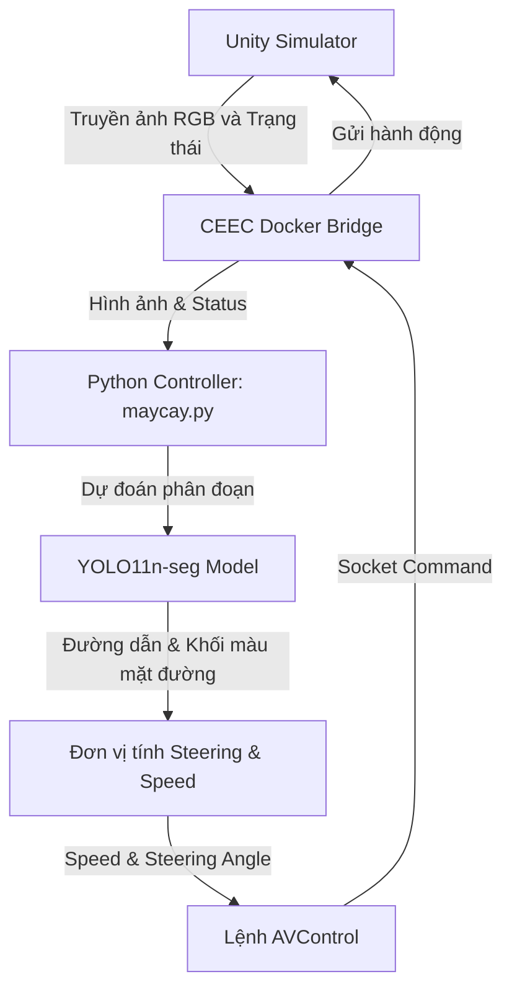

# 🏁 Dự án UIT-CAR-RACING: Unity Autonomous Road Segmentation & Navigation
> **Tổng quan hệ thống lái xe tự hành kết hợp giữa mô phỏng Unity 3D, phân đoạn làn đường (Road Segmentation) và phân đoạn biển báo giao thông (Traffic Sign Segmentation) sử dụng mô hình YOLO.**

---

## 📸 1. Tổng quan Dự án (Project Overview)

Dự án **UIT-CAR-RACING** là một hệ thống xe tự hành (autonomous car) hoạt động trong môi trường mô phỏng **Unity 3D**. Xe được trang bị hệ thống camera ảo truyền hình ảnh trực tiếp về bộ điều khiển Python để thực hiện phân đoạn hình ảnh (Image Segmentation) thời gian thực bằng mô hình học sâu **YOLO**, từ đó tính toán góc lái và tốc độ tối ưu giúp xe tự động bám làn đường và nhận diện các biển báo giao thông để đưa ra quyết định di chuyển phù hợp.

Dự án được xây dựng dựa trên 3 trụ cột chính:
1. **Unity Simulation**: Mô phỏng môi trường đường đua vật lý, xe hơi và hệ thống camera hành trình truyền dữ liệu RGB.
2. **CEEC Docker Container**: Đóng vai trò là cầu nối giao tiếp (communication bridge) thông qua giao thức Socket kết nối giữa Unity (C#) và Python Controller.
3. **Python Controller (`maycay.py`)**: Bộ não xử lý chính, chạy mô hình YOLO11n-seg thời gian thực để phân đoạn đường và điều khiển hành trình của xe.

---

## 🛠️ 2. Kiến trúc Hệ thống & Luồng Dữ liệu (System Architecture)

Luồng hoạt động tuần hoàn của hệ thống diễn ra như sau:



1. **Unity Simulator** gửi dữ liệu hình ảnh camera trước và trạng thái xe qua Socket ở cổng `11000`.
2. **Python Controller (`maycay.py`)** tiếp nhận dữ liệu bằng thư viện `client_lib`:
   - Hàm `GetRaw()` lấy ảnh RGB thô từ camera mô phỏng.
   - Hàm `GetStatus()` lấy trạng thái hiện tại của xe (tốc độ, vị trí...).
3. Mô hình **YOLO11n-seg** tiến hành phân đoạn mặt đường và phát hiện biển báo từ ảnh RGB thô.
4. Thuật toán điều khiển lái **Steering & Speed Logic** tính toán góc bẻ lái (`steering_angle`) dựa trên sai lệch tâm làn đường (Center Lane Error) kết hợp kiểm soát tốc độ thích ứng.
5. Hàm `AVControl(speed, angle)` truyền lệnh điều khiển ngược lại Unity để cập nhật chuyển động cho xe.

---

## 🧩 3. Các Thành phần Chính (Main Components)

Dự án bao gồm 2 bài toán thị giác máy tính chính chạy song song hoặc độc lập nhằm tối ưu hóa khả năng tự hành:

### 🛣️ Thành phần A: Phân đoạn làn đường (Road Segmentation)
Giúp xe luôn đi đúng phần đường của mình bằng cách xác định chính xác khu vực mặt đường.

* **Mô hình**: Sử dụng **YOLO11n-seg** (hoặc YOLOv8-seg) được tối ưu hóa siêu tham số để chạy real-time mượt mà trên phần cứng giới hạn.
* **Thuật toán điều khiển lái (Steering Logic)**:
  - Dự đoán mặt đường và sinh ra mặt nạ nhị phân (Binary Mask) của làn đường.
  - Sử dụng **Lane Width Estimator** để ước lượng độ rộng của làn đường nhằm phát hiện khi đường đột ngột mở rộng rộng hơn bình thường.
  - Quét từng dòng pixel từ đáy ảnh lên để xác định tâm làn đường (Center points).
  - Kết hợp sai lệch giữa điểm gần (Near Point - tin cậy khi đường rộng/cong) và điểm xa (Far Point - định hướng hướng đi tương lai) để tạo ra sai số blended thích ứng (`blended_error`).
  - Sử dụng hệ số bẻ lái thích ứng $K$ dựa trên độ cong của đường nhằm giúp xe bo cua mượt mà và chạy nhanh ở đường thẳng.

---

### 🚦 Thành phần B: Phân đoạn & Nhận diện Biển báo (Traffic Sign Segmentation)
Giúp xe nhận biết các biển báo chỉ dẫn hoặc biển cấm trên đường đua để đưa ra phản ứng kịp thời.

* **5 Lớp Biển báo Mục tiêu (Classes)**:
  
  | ID | Tên Nhãn | Ý nghĩa |
  | :--- | :--- | :--- |
  | **0** | `di_thang` | Biển chỉ dẫn đi thẳng |
  | **1** | `re_trai` | Biển chỉ dẫn rẽ trái |
  | **2** | `re_phai` | Biển chỉ dẫn rẽ phải |
  | **3** | `cam_re_trai` | Biển cấm rẽ trái |
  | **4** | `cam_re_phai` | Biển cấm rẽ phải |

* **Quy trình gán nhãn tự động bằng SAM (Segment Anything Model)**:
  - Tận dụng sức mạnh của **SAM** để tự động tạo mặt nạ phân đoạn chất lượng cao từ ảnh thô chụp trong Unity.
  - Lọc mặt nạ thông qua **Circularity Detection** (Độ tròn hệ số: $Circularity = \frac{4\pi \times Area}{Perimeter^2}$) để chỉ giữ lại các mặt nạ biển báo hình tròn chuẩn (ngưỡng $\ge 0.8$).
* **Huấn luyện YOLO11n-seg**:
  - Dữ liệu biển báo được sinh tự động và phân bổ nhãn theo dải chỉ số ảnh.
  - Áp dụng các kỹ thuật tăng cường dữ liệu chuyên biệt (Albumentations) như tăng độ tương phản, nhiễu bóng râm để nâng cao độ bền của mô hình.
* **Triển khai thời gian thực trên Unity**:
  - Mô hình sau khi huấn luyện sẽ được xuất sang định dạng **ONNX** (`FP16`, `simplify=True`).
  - Tích hợp trực tiếp vào Unity bằng plugin **Unity Barracuda** để chạy inference trực tiếp trên GPU mô phỏng mà không cần truyền dữ liệu ra ngoài Python khi triển khai độc lập.

---

## 📂 4. Cấu trúc Thư mục Dự án (Project Structure)

```text
UIT-CAR-RACING/
├── .git/                                   # Thư mục quản lý phiên bản Git
├── Road_Seg_Model/                         # Lưu trữ mô hình phân đoạn làn đường
│   ├── modelYolo/                          # Kết quả huấn luyện của mô hình phân đoạn đường (đã chạy trước đó)
│   │   ├── weights/
│   │   │   ├── best.pt                     # Trọng số tốt nhất (đang sử dụng trong maycay.py)
│   │   │   └── last.pt                     # Trọng số của epoch cuối cùng
│   │   └── ...                             # Các đồ thị, kết quả train chi tiết
├── training/                               # Thư mục hợp nhất toàn bộ bộ công cụ huấn luyện YOLO tự tạo
│   ├── configs/                            # Chứa các file cấu hình tập dữ liệu (.yaml)
│   │   ├── road_seg.yaml                   # File cấu hình tập dữ liệu Phân đoạn Đường
│   │   └── traffic_sign_seg.yaml           # File cấu hình tập dữ liệu Biển báo Giao thông
│   ├── utils/                              # Chứa các công cụ phụ trợ tiền xử lý dữ liệu và dán nhãn
│   │   ├── __init__.py                     # File khai báo package Python
│   │   ├── convert_mask_to_yolo.py         # Trích xuất contours nhãn đường chuyển đổi sang Polygon YOLO .txt
│   │   └── prepare_sign_dataset.py         # Tạo tự động dữ liệu biển báo từ SAM + lọc tròn + sinh nhãn rỗng
│   ├── train_road.py                       # Kịch bản chạy huấn luyện YOLO phân đoạn đường (cấu hình chống crash)
│   ├── train_yolo_signs.py                 # Kịch bản train biển báo (tắt lật fliplr=0.0, imgsz=320, mosaic=0.3)
│   └── export_onnx.py                      # Công cụ xuất trọng số .pt sang .onnx tối ưu (simplify=True, opset=13)
├── docs/                                   # Thư mục chứa tài liệu hướng dẫn/lịch sử hệ thống cũ (giữ cho gọn gốc)
├── maycay.py                               # Mã nguồn Python điều khiển xe tự hành chính chạy thời gian thực
├── README.md                               # Hướng dẫn thiết lập chạy môi trường giả lập Unity + Docker
├── PROJECT_SUMMARY.md                      # [TÀI LIỆU NÀY] Tổng quan kiến trúc hệ thống
└── YOLO_TRAINING_GUIDE.md                  # Hướng dẫn chi tiết cách tự train cả 2 mô hình YOLO
```

---

## 📈 5. Các Điểm Nổi bật & Chiến lược Tối ưu (Highlights & Optimization Strategies)

* **Background Learning với Empty Labels**: Trong tập dữ liệu biển báo giao thông, một lượng lớn ảnh không chứa biển báo vẫn được đưa vào huấn luyện với nhãn `.txt` rỗng. Việc này giúp YOLO học được bối cảnh nền (background), làm giảm thiểu tối đa tỷ lệ báo động giả (False Positives) khi xe di chuyển qua khu vực trống.
* **Hạn chế Augmentation làm sai lệch nhãn**: Đối với biển báo rẽ trái/phải, việc áp dụng lật ngang (Horizontal Flip) hoặc thay đổi màu sắc quá đà (Channel Shuffle) sẽ làm biến đổi bản chất của nhãn (ví dụ: biển rẽ trái bị lật thành rẽ phải, hoặc biển cấm màu đỏ bị đổi màu). Hệ thống đã cấu hình loại bỏ hoặc hạn chế tối đa các phép biến đổi nguy hại này.
* **Khắc phục lỗi bộ nhớ Docker (Shared Memory)**: Khi chạy huấn luyện YOLO trên môi trường Docker của Ubuntu/WSL, việc cạn kiệt phân vùng bộ nhớ dùng chung `/dev/shm` thường gây crash dữ liệu (`DataLoader worker exited unexpectedly`). Dự án đề xuất giải pháp giảm `workers=0`, chuyển sang `cache='disk'` và tăng kích thước phân vùng Docker cực kỳ hiệu quả.

---
*Tài liệu được tổng hợp chi tiết từ các tài liệu gốc và mã nguồn của dự án UIT-CAR-RACING.*
